# Base de datos

## Definición

Se puede decir que es un sistema utilizado para almacenar datos pero hay muchas formas de almacenar datos.

Se puede decir que también es un sistema informático para almacenar datos.

# Base de datos relacional

Impone reglas específicas en un sistema que gobierna como se estructuran los datos almacenado y recuperado (En este tipo de base de datos, los datos se organizan en tablas que contienen filas y columnas).

## Un ejemplo de base de datos relacional

Tienes dos columnas con las filas necesarias para las mascotas de cada persona, una columna con el nombre de la mascota y otra con el tipo de animal que es. Luego tienes que añadir otra tabla para el identificador del dueño de la mascota.

## Un sistema de gestión de bases de datos relacionales

Te da herramientas para construir una base de datos para cumplir su conjunto de requisitos. Una vez creada la tabla el “sistema de gestión de base de datos” o “RDBMS” le ayudará a organizar y almacenar sus datos.

### Consejos para empresas

- Empresas pequeñas: Estaría bien servida con un RDBMS de escritorio como Microsoft Access o FileMaker.
- Empresas medianas, grandes y clientes empresariales con sus propios centros de datos: Estarían bien servidos con Microsoft SQL Server, Oracle, PostgreSQL o MySQL.
- Si desea que sus datos se almacenen en la nube estarían bien Microsoft Azule SQL Database o Amazon RDS.

## NOTA

> Todos los conceptos de este _curso_ valen para cualquier tipo de sistema operativo.


# Modelo cliente-servidor

1. Primero está el **servidor de base de datos** donde se almacenan y aseguran los datos.
2. El segundo componente es el **cliente**, es la interfaz que permite a los usuarios conectarse al servidor para enviar comandos y controlar su funcionamiento.

## Otras consideraciones

- Se pueden realizar conexiones a través de sistemas separados y reunir información de formas nuevas y impactantes.
- Tienes que buscar un servidor de base de datos compatible con el sistema operativo que estes usando.

## Crea tu propia base de datos

### 2 problemas

1. Los servidores esperan a que se ejecuten en hardware dedicado.
2. Los servidores de bases de datos esperan tener control total sobre su hardware.

### Solución a ambos problemas

La solución es instalar software de gestión de base de datos dentro de un recipiente aislado.

Los contenedores crean un gestor de base de datos y los componentes necesarios pueden hacer lo que sea necesario sin tener posibilidad de realizar cambios en su programa principal.

## Contenedores

- Son rápidos de crear.
- Diseñados para ser efímeros.
- No tienes que tener miedo de estropear algo.

## Aplicaciones necesarias

- [Descargar Docker](https://www.docker.com/products/docker-desktop) que se encarga de administrar contenedores.

Todos los comandos de Docker comienzan con la palabra `docker`.

## Comandos básicos Docker

```bash
docker version.
```

Si pones `docker` solo, te dará una lista de comandos que puedes usar.

Si buscas información sobre un comando para una cosa en concreto, por ejemplo `docker images`, lo escribes y das enter, ahí te aparecerán opciones para hacer con fotos en Docker.

## Imagenes
Son paquetes de software que describe una instalación predeterminada del software y todos los componentes que necesita para ejecutarse.

El proceso comienza con la optención de la imagen, descargamos Microsoft SQL server.

Iniciamos el terminal y escribimos el comando de arriba si eres de Windows y los de abajo si eres Mac o linux.

Windows PC:

~~~
docker run --name sqlserver2019 -e "ACCEPT_EULA=Y" -e "SA_PASSWORD=Adam123456" -p 1401:1433 -d mcr.microsoft.com/mssql/server:2019-latest
~~~
MacOS & Linux:

~~~
docker run --name sqlserver2019 -e 'ACCEPT_EULA=Y' -e 'SA_PASSWORD=Adam123456' -p 1401:1433 -d mcr.microsoft.com/mssql/server:2019-latest
~~~

Una vez ejecutado el comando te descargará una imagen, recibirás una alerta y le tienes que dar a permitir. Así ya tienes un contenedor en el sistema listo para usar.

Luego abrimos la terminal de nuevo y escribimos el siguiente comando:
~~~
docker run --name postgresql -p 5401:5432 -e POSTGRES_PASSWORD=Adam123456 -d postgres:latest
~~~

Este comando nos descargará otra imagen(Sigue los pasos del anterior)
Acabada la descarga tendremos dos contenedores con dos sistemas de gestión de base de datos relacionales diferentes.

Escribe el comando Docker ps para mostrar las imagenes/contenedores en ejecución.
Si quieres ver los contenedores detenidos y en ejecución escribe Docker ps -a.
Si quieres detener un contenedor escribe docker stop my el nombre del contenedor.

## Interfaces de linea de comandos Docker

Microsoft SQL server

Iniciamos sesión en docker.

Ponemos `docker exec -it` y el nombre del server al que queremos conectarnos bash al final.

Ejemplo:

```bash
docker exec -it sqlserver2019 bash.
```

Ahora entrar en la carpeta en este caso la mia es:

```bash
/opt/mysql-tools/bin/sqlcmd -U sa -P Adam123456
```

La `-U` es para especificar la cuenta del usuario y la `-P` es para escribir la contraseña.

Puesto esto te pide el comando de la primera linea, puedes ver la versión, en la primera linea pones SELECT  @@version y en la segunda línea pones GO y dice la versión.

También puedes crear bases de datos, en la primera linea escribes CREATE DATABASE y el nombre que le quieres poner, en la segunda linea escribes GO para ejecutar la petición.
Si quieres salir solo tienes que escribir exit y listo.

PostgreSQL

Ponemos docker exec -it y el nombre del server al que queremos conectarnos bash al final.

Para ver la información del contenedor escribe cat /etc/os-release.

El usuario para Postgres es psql -u postgres.

Si escribes ayuda, te aparecerán comandos que puedes usar.

Si escribes \l te lista las bases de datos en orden.

También puedes crear bases de datos, en la primera linea escribes CREATE DATABASE y el nombre que le quieres poner.

Para salir de la herramienta PSQL escibes \q.

Para salir del contenedor escribes exit.

## Interfaces gráficas
Es más facil de usar que la linea de comandos.

Puedes simular un entorno de varios servidores mucho más complejo.

Otra cosa buena que tiene es que todos tenemos que aprender un conjunto de herramientas que tiene para comunicarse con ambos servidores.

### Opciones para elegir un servidor gráfico

SQL Server Management Studio es de Microsoft (No hay versiones para MAC o Linux).

DBeaver Es muy popular, funcionará con varias bases de datos diferentes, la grafica es mucho más pequeña que el SQL Server Management Studio pero se puede ver igual.

Otra opción y de las mejores es Azure Data Studio es una interfaz multiplataforma  que funciona con el servidor SQL y servidores de bases de datos de Postgres para conectarlos directamente a los dos contenedores de Docker.

# Instalación de Azure Data Studio y uso (Neste apartado tiven problemas cos videos, tentei solucionalos pero non din, así que decidín informarme por foros en internet).

Tiene un editor de código SQL.

Se puede ejecutar en Windows, MAC y Linux.

Si el archivo .zip se va a usar para la instalación de Azure Data Studio, primero tiene que descomprimir la carpeta sqlops-windows, debajo de la carpeta sqlops-windows, busque y haga doble clic en sqlops.exe para ejecutarlo.

Esto abrirá la ventana de Azure Data Studio. En el cuadro Servidor, escriba el nombre de la instancia para la que desea establecer la conexión y presione el botón Conectar 

Si la ventana de conexión no aparece el momento en que se abre la ventana de Azure Data Studio, simplemente haga clic en el botón Nueva conexión 

En el caso de que no aparezca el panel, diríjase al panel Servidores, haga clic con el botón derecho y, en el menú contextual, seleccione el comando Administrar 

Bajo la versión de SQL Server, hay varios accesos directos a tareas comunes a nivel de servidor: restaurar bases de datos, configurar el servidor y crear una nueva consulta.

Tiene un panel de Estado de la copia de seguridad, aquí se muestra el estado de la copia de seguridad de las bases de datos.

se puede cambiar a Símbolo del sistema (CMD) o a un terminal BASH haciendo simplemente clic en el botón Personalizar y, en la lista, seleccione el terminal deseado.

Se pueden abrir múltiples terminales en SQL Operation Studio presionando “Ctrl + Shift +` combinación de teclado o presionando el icono más en la terminal.
 Para poder cambiar entre terminales abiertos, use la lista desplegable.


Bajo el ícono del Explorador está el ícono de Búsqueda que trae el panel de Búsqueda para poder buscar y reemplazar texto en los archivos: 
 
El panel de control de fuente nos permite administrar archivos con el sistema de control de código fuente. Azure Data Studio admite Git para el control de versión/fuente. Para poder utilizar esta función, primero se debe instalar el

Casi todas las partes de Azure Data Studio se pueden modificar a través de las opciones de configuración de usuario. Para poder abrir la configuración, tiene que hacer clic con el botón derecho en el icono de Configuración y en el menú contextual, elija el comando Configuración: 
 
O utilice el método abreviado de teclado (Ctrl +,). Otra forma de abrir la configuración es usando la paleta de comandos (Ctrl + Shift + P) y busque Preferencias: Abrir configuración de usuario 
 
Debajo de la lista, puede elegir la opción que desea modificar (por ejemplo, deshabilitando la opción de actualización), ejecute la configuración de actualización, haga clic en el botón Editar junto a la opción que desea usted modificar y desde el menú contextual, elija la opción que usted desee
Una vez que se elige la opción deseada, aparecerá el cuadro de información, que nos sugiere reiniciar Azure Data Studio para que los cambios puedan surtir efecto: 


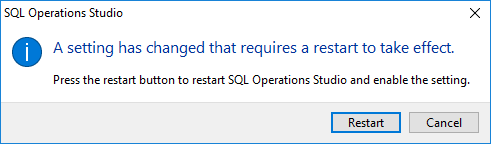
 
Después de haber reiniciado, los cambios se actualizarán y la opción Actualizar se desactivará
Todas las opciones se guardan en el archivo settings.json. Dependiendo de qué plataforma (Windows, Mac, Linux) se esté utilizando el Azure Data Studio, la ubicación del archivo settings.json es diferente para cada plataforma. 

Azure Data Studio tiene la capacidad de poder organizar la conexión a los servidores y las bases de datos en grupos separados y asignar un color a los grupos de servidores. 
Para poder crear un grupo de servidores, tiene que presionar el botón Nuevo grupo de servidores en la parte superior del panel Servidores. 
En el cuadro Nombre del grupo de servidores, tiene que ingresar el nombre del grupo y desde la paleta de colores del grupo, tiene que elegir el color que desee para el grupo y presione el botón de OK.

Después de presionar el botón OK, hay la posibilidad de que pueda aparecer un mensaje de error: 
Esto aparece porque el modo de colores de la pestaña se encuentra desactivado por defecto. Para poder habilitar los colores de las pestañas en el archivo de configuración del usuario, la configuración sql.tabColorMode y en el menú contextual, elija el siguiente comando “relleno”.
El último icono en el lado derecho de la cuadrícula de resultados es el icono de Ver como gráfico.

## Como crear una base de datos en Azure
Escribes 
~~~
SELECT * FROM sys.databases; (te da un cuadro con información).
~~~
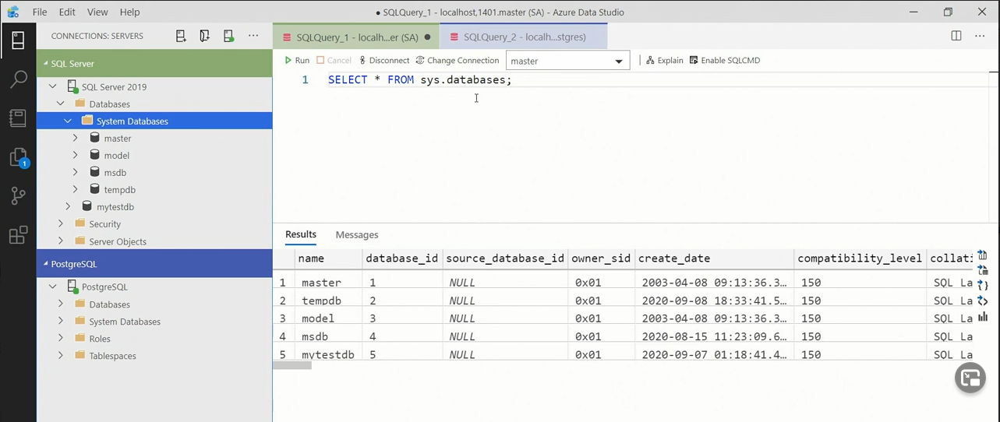

Escribes
~~~
 SELECT * FROM pg_database;(te da otro cuadro).
~~~
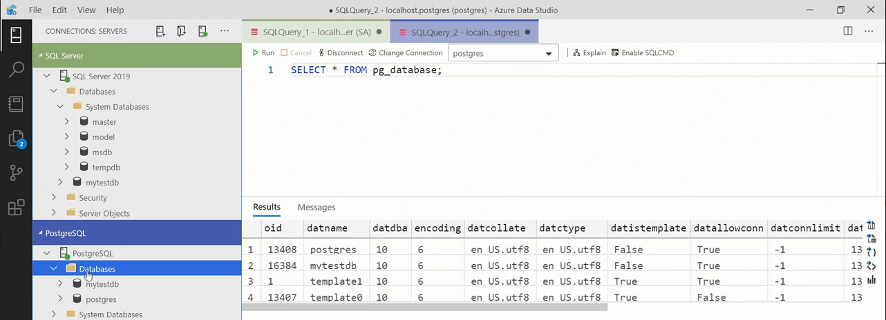

Escribes 
~~~
CREATE DATABASE TwoTrees; por ejemplo, y creas una base de datos con ese nombre.
~~~

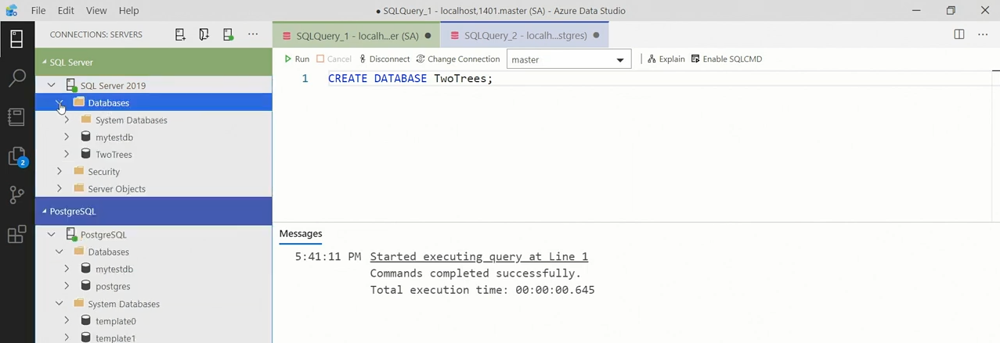

## Lenguaje de consulta estructurado

### Porque aprender SQL

Está diseñado para ser legible por humanos.

Tú escribes los comandos y el servidor los encuentra.

SQL perdona la escritura, no entiende entre mayúsculas y minúsculas.

En SQL es importante dividir los datos, unos son comandos de definición de datos utilizados para diseñar y construir y los otros se llaman comandos de grupo de manipulación de datos, estos comandos son utilizados para el almacenamiento de datos.

### Esquemas

Es común agrupar información de varias columnas en un esquema.

Los esquemas son un contenedor que recopila tablas y otros objetos de base de datos quer van entre si.

En las apps descargadas anteriormente, tienes esquemas ya creados, o tambien puedes crearlos tú mismo.

### Construcción de tablas

Las tablas están formadas por culumnas y cada columna almacena una sola pieza de información.

Necesitamos un nombre único para cada columna, sin espacios y todo en letras minúsculas.

Tambien necesitamos saber que tipo de datos almacenará cada columna.

Tener en cuenta que existe variación de unas cosas a otras.

El tipo de datos CHAR almacenará datos de caracteres, entre parentesis dices el número de caracteres que tiene.

Puedes usar colores diferentes para separar los tipos de productos.

Vamos a Azure Data Studio y escribimos CREATE Table y el nombre que quieres que tenga.

Pones parentesis () donde quieres que vaya la columna, con el nombre y los caracteres que tiene como por
~~~
 ejemplo (
	Sku(7) NOT NULL PRIMARY KEY,
	Productname CHAR (50),
	Price DECIMAL (5,2),
		);
~~~

Acordarse de poner SIEMPRE punto coma al final.

Si escribes NOT NULL al final de una columna esto significa que esa columna no puede quedar en blanco.

Escribe PRIMARY KEY despues del NOT NULL para marcar una clave principal.

Debereis ejecutarlo y el comando se ejecutará correctamente.

### Despues de las tablas

Para hacer un cambio en una tabla ya creada, debes usar el comando ALTER
~~~
	(
Productname CHAR (50),
	Price DECIMAL (5,2),
	);
ALTER TABLE y el nombre que desees.
~~~
ADD nombre que quieras poner y CHAR (número de letras que tiene).

Como la mesa ya existe va a dar error, Debes ejecutar una parte del comando que tú quieras resaltar y luego moverlo a la carpeta que creara anteriormente.

### Comandos aún sin ver

Se deben usar delimitadores (“”) para marcar una palabra importante.

Si van al manual de Postgres o Microsoft tienen una página que te dice todas las palabras que no se deben usar que ya están reservadas.

A medida que se van mejorando las funciones van apareciendo más palabras reservadas.

### Atributos de las columnas

Es importante comprender que el oreden que siguen las filas en las tablas es irrelevante

Se pueden clasificar las datos de las tablas, como por ejemplo el pedID, la edad…

Se puede identificar una única fila en cada tabla y encontrar un valor único.

### Agregar recortes

ve a la carpeta dunde quieras guardarlo

Inserta el nombre de la tabla donde quieres insertar la fila, escribe en la terminal:
~~~
INSERT INTO nombre que desees VALUES
(“FCP008”, “First Cold Press”, 1,5)
;
~~~
Luego debajo solo enumeraremos los valores para cada columna, ejemplo arriba.

Los valores enteros nop necesitan ir entre comillas.

Le dan a ejecutar y si no da error es que está bien.

Tiene una opción para elegir los mejores 1000 de tus filas de datos creadas anteriormente.

### Cambiar la palabra cable

abre una nueva terminal, escribe:
~~~
UPDATE nombre de la tabla
SET CategoryID=3,
	Size=4;
~~~
Si se ejecuta ahora mismo este comando, se cambiaría la categoría y el tamaño.

Si quieres modificar solo una fila específica, solo tienes que añadir WHERE como por ejemplo:

UPDATE nombre de la tabla
~~~
SET CategoryID=3,
	Size=4
	WHERE (nombre)SKU = Nombre dentro de la tabla‘OGEC00‘ ;
~~~

También se puede eliminar con el comando DELETE debeis tener cuidado porque en vez de eliminar la línea especíca podeis borrar toda la tabla.
~~~
DELETE FROM nombre de la tabla‘OGEC00
WHERE SKU = ‘OGEC004’;
~~~

### Guardar comandos SQL

Presionamos el botón de guardar y nos pide escoger en que zona del pc guardarlo, pongalo en el escritorio y  llamelo updatedelete por ejemplo.

Esta pate es muy importante

Cuando vulva a abrir el archivo presta atención a la base de datos que se dirige y en el servidor en el que está conectado

Puedes presionar el botón cambiar conexión y luego elegirás en la lista de conexiones recientes la conexión que desees.

Debes poner detalles del nombre de usuario realizados anteriormente.

## Consulta de datos

Se usa el comando SELECT.

SELECT permite recuperar filas de datos de sus tablas de datos. Pero este comando va mucho más hayá, con este comnando puedes cortar tus datos.

Para aprender a pedir datos es importantísimo resumir las cosas.

Puedes ver que clientes tienes, y puedes elegir ver x numero de filas o columnas, puedes ver los clientes que viven en España por ejemplo, se pueden filtrar varios criterios de filtrado.

Al reconfigurar los datos, tú limitas los valores.

### Volvemos al FROM Y SELECT

Si necesitas ver los nombres de tus archivos, puedes expoandir la carpeta en el lado izquierdo.

La clausula FROM especifica el nombre de la tabla.

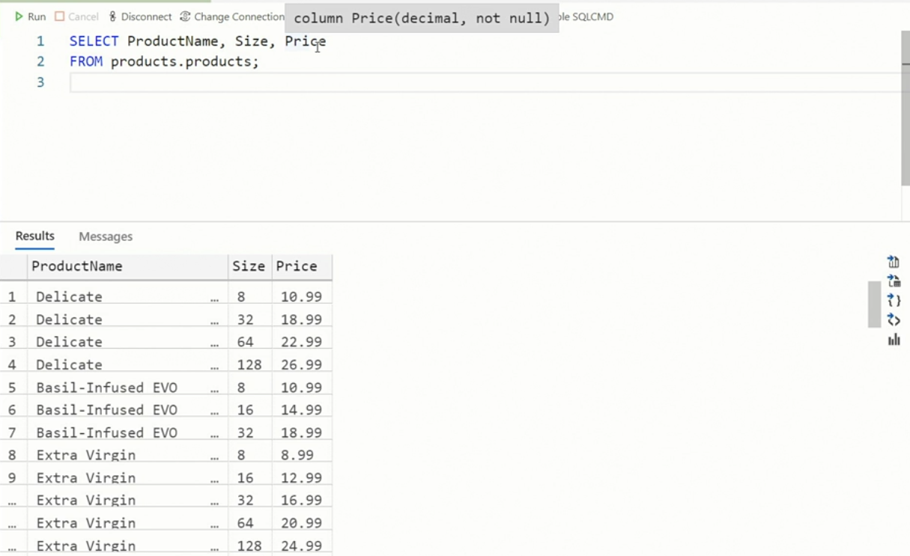

Con esta consulta nos debería dar el nombre, el tamaño y el precio del producto.

Puede reorganizar las columnas como desee.

### Filtrar filas con WHERE
~~~
SELECT *
FROM nombre que le pusiste
~~~
Te aparecen todos los resultados

Ahora supongamos que solo queremos ver los resultados de la categoría número dos
~~~
SELECT *
FROM nombre que le pusiste
WHERE Price >  25;
~~~
Te aparecen todos los productos que cuestan más de 25 euros en mi caso.
~~~
SELECT *
FROM nombre que le pusiste
WHERE NOT Price >  25;
~~~

Ahora aparecerán los que no cuestan más de 25 euros
~~~
SELECT *
FROM nombre que le pusiste
WHERE Price >  10 AND  Size < 12 ;
~~~
Estos dará un tamaño entre 10 y 12.
~~~
SELECT *
FROM nombre que le pusiste
WHERE CategoryID = 2 or CategoryID = 3;
~~~
Si pones esto, apareceran los productos de la categoría 2 y si sigues bajando los de la 3.
~~~
SELECT *
FROM nombre que le pusiste
WHERE ProductName  =  pure;
~~~
Aparecerán todos los de categoría puros.

### Ver datos en secuencia

Pulsa el atajo control + N

```sql
SELECT *
FROM nombre
WHERE Size = 8
ORDER BY Price;
```

Escribiendo eso, nos ordena el precio de más barato a más caro.

```sql
SELECT *
FROM nombre
WHERE Size = 8
ORDER BY Price DESC;
```

Ahora añadiendo DESC nos ordena de mayor a menor.

```sql
SELECT *
FROM nombre 1
JOIN nombre 2
ON nombre 1 = nombre 2;
```

Si escribes esto, juntas las dos tablas. 

El comando ON es para decir las tablas que crean ese enlace que deseas.

En SQL Server:

```sql
SELECT TOP 5 *
FROM nombre
ORDER BY Price DESC;
```

Me devuelve solo 5 filas.

```sql
SELECT TOP (10) PERCENT*
FROM nombre
ORDER BY Price DESC;
```

Devuelve el 10 % del total de las filas que tengas.

En Postgres para devolver las cinco filas tienes que poner:

```sql
SELECT  *
FROM nombre
ORDER BY Price DESC
LIMIT 5;
```

## Mostrar alias con AS

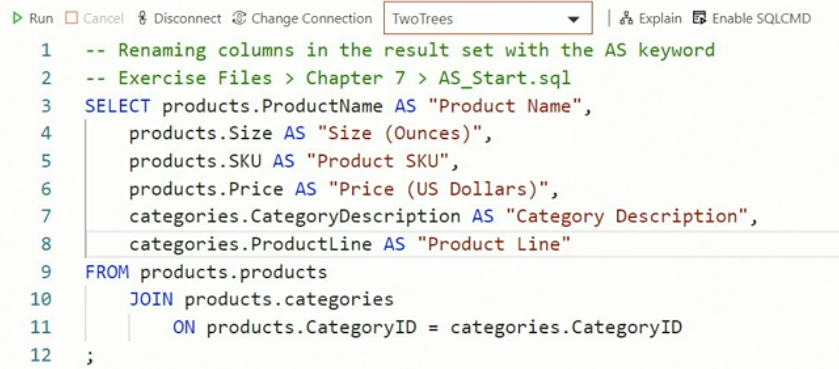

Con el comando AS cambiamos el nombre de las columnas para que estén más claras.

Si colocas el ratón entre columnas puedes moverlas para ver toda la información que posee.

Hacer esto te da más seguridad porque no tienen ni idea de como se llaman las columnas en realidad.

También se puede cambiar el nombre de tablas con el comando AS.

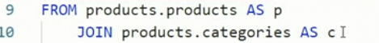

En este caso products.products se llama p y products.categories se llama c.

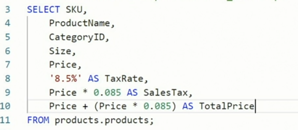

Con las líneas 8, 9, 10 añadimos nuevas columnas a nuestra tabla de datos.

Nos dan el valor total y el valor del impuesto.

Se el precio de un producto cambia, los valores se calcularán automaticamente.

### Las funciones

Las funciones se escriben asi: 

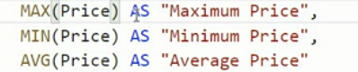

y luego entre parentesis le dices los valores que quieres que procese.

La primera columna mostrará el precio máximo la segunda el precio mínimo y la tercera el precio promedio.

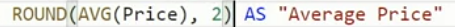

Haciendo este cambio, los precios que te dan en la tabla te los dan con 2 decimales solo en este caso.

### Agrupar líneas

Primero debemos decirle al servidor que queremos agrupar líneas, se hace con el comando GROUP BY.

GROUP BY iría despues del comando WHERE y antes del comando ORDER BY.

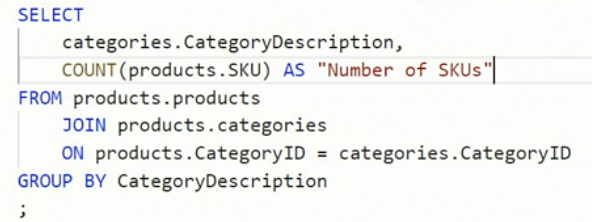

Este comando toma las filas de la misma categoría y los agrupa.

Con order by hicimos que se ordenaran también los datos descendientemente.

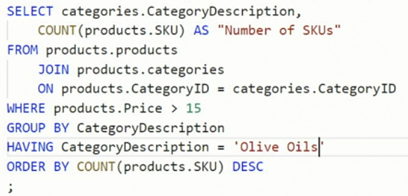

Ese WHERE hace que salgan solo la cantidad de productos que cuestan menos de 15 euros y con el HAVING lo que hace es que muestra la columna de aceites de oliva que cuestan menos de 15 euros.

# Permíteme felicitarte por llegar hasta aquí y entender un poco más sobre las bases de datos. :)

